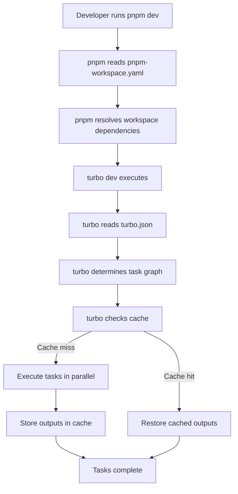

# Design Document

## Overview

This design establishes a production-grade monorepo workspace configuration for OpenWitness, enabling efficient development across multiple applications and shared packages. The configuration leverages modern tooling (pnpm v11, TurboRepo v2, TypeScript 5+) to provide fast builds, consistent code style, and reliable dependency management.

The workspace structure consists of:
- **Applications** (`apps/`): api, web
- **Shared Packages** (`packages/`): config, types, ui, utils
- **Documentation** (`docs/`)

Key design principles:
- **Zero Configuration for Consumers**: Workspace packages inherit sensible defaults
- **Optimization Through Caching**: TurboRepo caches task outputs based on content hashing
- **Strict Dependency Management**: Prevent phantom dependencies and ensure reproducible builds
- **Tooling Consistency**: Unified formatting, linting, and type-checking across all packages

## Architecture

### Configuration File Hierarchy

```
openwitness/
├── .editorconfig           # Cross-editor basic formatting
├── .npmrc                  # pnpm behavior configuration
├── .prettierrc             # Code formatting rules
├── .prettierignore         # Formatting exclusions
├── pnpm-workspace.yaml     # Workspace package locations
├── turbo.json              # Build orchestration pipelines
├── tsconfig.base.json      # Shared TypeScript config
├── package.json            # Root workspace metadata
├── apps/
│   ├── api/
│   │   ├── package.json
│   │   └── tsconfig.json   # Extends tsconfig.base.json
│   └── web/
│       ├── package.json
│       └── tsconfig.json   # Extends tsconfig.base.json
├── packages/
│   ├── config/
│   ├── types/
│   ├── ui/
│   └── utils/
└── docs/
```

### Tool Integration Flow



### Configuration Layering

1. **Editor Layer** (`.editorconfig`): Basic formatting enforced by editors
2. **Package Manager Layer** (`.npmrc`, `pnpm-workspace.yaml`): Dependency resolution
3. **Code Quality Layer** (`.prettierrc`, `tsconfig.base.json`): Formatting and type-checking
4. **Orchestration Layer** (`turbo.json`): Task execution and caching
5. **Metadata Layer** (`package.json`): Workspace scripts and tooling versions

## Components and Interfaces

### 1. Workspace Definition Component

**File**: `pnpm-workspace.yaml`

**Purpose**: Declares which directories contain packages managed by pnpm

**Interface**:
```yaml
packages:
  - 'apps/*'
  - 'packages/*'
  - 'docs'
```

**Behavior**:
- pnpm scans declared paths for `package.json` files
- Creates symlinks in `node_modules` for workspace packages
- Shares single `pnpm-lock.yaml` across all packages

### 2. Build Orchestration Component

**File**: `turbo.json`

**Purpose**: Defines task pipelines with caching and dependency management

**Interface**:
```json
{
  "$schema": "https://turbo.build/schema.json",
  "pipeline": {
    "build": {
      "dependsOn": ["^build"],
      "outputs": ["dist/**", ".next/**"]
    },
    "dev": {
      "cache": false,
      "persistent": true
    },
    "lint": {
      "dependsOn": ["^build"]
    },
    "test": {
      "dependsOn": ["^build"],
      "outputs": ["coverage/**"]
    },
    "clean": {
      "cache": false
    }
  }
}
```

**Task Definitions**:
- **build**: Compiles packages, depends on dependencies being built first (`^build`)
- **dev**: Runs development servers, not cached (always fresh), persistent (stays running)
- **lint**: Runs linters, depends on build outputs
- **test**: Runs tests, depends on build outputs, caches coverage reports
- **clean**: Removes build artifacts, never cached

**Caching Strategy**:
- Content-based hashing of inputs (source files, dependencies)
- Output directories stored in local cache (`.turbo/cache`)
- Cache hits restore outputs without re-execution

### 3. Type System Component

**File**: `tsconfig.base.json`

**Purpose**: Provides shared TypeScript compiler configuration

**Interface**:
```json
{
  "compilerOptions": {
    "target": "ES2022",
    "lib": ["ES2022"],
    "module": "ESNext",
    "moduleResolution": "bundler",
    "strict": true,
    "esModuleInterop": true,
    "skipLibCheck": true,
    "forceConsistentCasingInFileNames": true,
    "resolveJsonModule": true,
    "isolatedModules": true,
    "incremental": true,
    "noEmit": true,
    "paths": {
      "@openwitness/types": ["./packages/types/src/index.ts"],
      "@openwitness/utils": ["./packages/utils/src/index.ts"],
      "@openwitness/config": ["./packages/config/src/index.ts"],
      "@openwitness/ui": ["./packages/ui/src/index.ts"]
    }
  },
  "exclude": ["node_modules", "dist", "build", ".next"]
}
```

**Key Options**:
- **strict**: Enables all strict type-checking options
- **moduleResolution: "bundler"**: Modern resolution for bundlers like Vite/Webpack
- **paths**: Allows importing workspace packages by name without relative paths
- **noEmit**: Type-checking only (actual compilation handled by package-specific tools)
- **incremental**: Faster subsequent type checks

**Extension Pattern**:
Workspace packages extend the base config:
```json
{
  "extends": "../../tsconfig.base.json",
  "compilerOptions": {
    "outDir": "./dist"
  },
  "include": ["src"]
}
```

### 4. Code Formatting Component

**Files**: `.prettierrc`, `.prettierignore`

**Purpose**: Enforces consistent code style across all file types

**Configuration** (`.prettierrc`):
```json
{
  "semi": true,
  "trailingComma": "es5",
  "singleQuote": true,
  "printWidth": 100,
  "tabWidth": 2,
  "useTabs": false,
  "arrowParens": "always",
  "endOfLine": "lf"
}
```

**Exclusions** (`.prettierignore`):
```
node_modules
dist
build
.next
.turbo
coverage
pnpm-lock.yaml
*.min.js
```

**Supported File Types**:
- JavaScript/TypeScript (`.js`, `.jsx`, `.ts`, `.tsx`)
- Markup (`.json`, `.md`, `.yaml`, `.html`)
- Styles (`.css`, `.scss`)

### 5. Editor Configuration Component

**File**: `.editorconfig`

**Purpose**: Ensures basic formatting consistency across different editors

**Interface**:
```ini
root = true

[*]
charset = utf-8
end_of_line = lf
insert_final_newline = true
trim_trailing_whitespace = true

[*.{js,jsx,ts,tsx,json,yml,yaml,md}]
indent_style = space
indent_size = 2

[*.md]
trim_trailing_whitespace = false
```

**Behavior**:
- Applies to all files in the workspace
- Most modern editors support EditorConfig automatically
- Provides baseline formatting before Prettier runs

### 6. Package Manager Configuration Component

**File**: `.npmrc`

**Purpose**: Controls pnpm behavior for dependency management

**Configuration**:
```
# Strict dependency management
strict-peer-dependencies=true
auto-install-peers=false

# Performance optimization
shamefully-hoist=false
prefer-frozen-lockfile=true

# Security
enable-pre-post-scripts=false

# Publishing prevention for workspace root
publish-workspace-packages=false
```

**Key Settings**:
- **strict-peer-dependencies**: Fails if peer dependencies aren't installed
- **auto-install-peers=false**: Requires explicit peer dependency installation
- **shamefully-hoist=false**: Prevents hoisting all dependencies (avoids phantom deps)
- **enable-pre-post-scripts=false**: Security measure to prevent untrusted scripts

### 7. Root Package Component

**File**: `package.json` (root)

**Purpose**: Defines workspace metadata, scripts, and tooling dependencies

**Structure**:
```json
{
  "name": "openwitness",
  "version": "0.0.0",
  "private": true,
  "type": "module",
  "packageManager": "pnpm@11.15.1",
  "engines": {
    "node": ">=22.0.0",
    "pnpm": ">=11.0.0"
  },
  "scripts": {
    "dev": "turbo dev",
    "build": "turbo build",
    "lint": "turbo lint",
    "test": "turbo test",
    "format": "prettier --write \"**/*.{js,jsx,ts,tsx,json,md,yml,yaml}\"",
    "format:check": "prettier --check \"**/*.{js,jsx,ts,tsx,json,md,yml,yaml}\"",
    "clean": "turbo clean && rm -rf node_modules .turbo",
    "typecheck": "turbo typecheck"
  },
  "devDependencies": {
    "turbo": "^2.3.3",
    "typescript": "^5.7.2",
    "prettier": "^3.4.2",
    "@types/node": "^22.10.5"
  }
}
```

**Script Delegation**:
- All task-oriented scripts (`dev`, `build`, `lint`, `test`) delegate to TurboRepo
- `format` scripts run Prettier directly (not per-package)
- `clean` combines turbo cache clearing with node_modules removal

## Data Models

### Workspace Manifest Model

Represents the structure defined in `pnpm-workspace.yaml`:

```typescript
interface WorkspaceManifest {
  packages: string[];  // Glob patterns like 'apps/*', 'packages/*'
}
```

**Validation Rules**:
- Patterns must be valid glob syntax
- Referenced directories must exist
- Each matched directory must contain a `package.json`

### TurboRepo Pipeline Model

Represents task configuration in `turbo.json`:

```typescript
interface TurboPipeline {
  pipeline: Record<string, TaskDefinition>;
}

interface TaskDefinition {
  dependsOn?: string[];      // Tasks this task depends on
  outputs?: string[];        // Directories/files to cache
  cache?: boolean;           // Whether to cache (default: true)
  persistent?: boolean;      // Keep running (for dev servers)
  env?: string[];            // Environment variables affecting cache
  inputs?: string[];         // Input globs (default: all files)
}
```

**Dependency Notation**:
- `^build`: Depends on `build` task of workspace dependencies
- `build`: Depends on `build` task in the same package (topological)

### TypeScript Configuration Model

Represents shared compiler options:

```typescript
interface TSConfig {
  extends?: string;          // Path to base config
  compilerOptions: {
    target: string;          // JS version to compile to
    module: string;          // Module system
    strict: boolean;         // Enable strict checking
    paths?: Record<string, string[]>;  // Path aliases
    [key: string]: unknown;  // Other compiler options
  };
  include?: string[];        // Files to include
  exclude?: string[];        // Files to exclude
}
```

**Extension Chain**:
1. `tsconfig.base.json` defines workspace defaults
2. Package-specific `tsconfig.json` extends base and adds local config
3. TypeScript merges configurations (local overrides base)

### Prettier Configuration Model

```typescript
interface PrettierConfig {
  semi: boolean;             // Semicolons
  trailingComma: 'none' | 'es5' | 'all';
  singleQuote: boolean;      // Quote style
  printWidth: number;        // Line length
  tabWidth: number;          // Spaces per indent
  useTabs: boolean;          // Tabs vs spaces
  arrowParens: 'avoid' | 'always';
  endOfLine: 'lf' | 'crlf' | 'auto';
}
```

### EditorConfig Model

```typescript
interface EditorConfig {
  root: boolean;             // Stop searching in parent dirs
  sections: Record<string, EditorSettings>;
}

interface EditorSettings {
  charset?: string;          // File encoding
  end_of_line?: 'lf' | 'crlf' | 'cr';
  insert_final_newline?: boolean;
  trim_trailing_whitespace?: boolean;
  indent_style?: 'space' | 'tab';
  indent_size?: number;
}
```

**Pattern Matching**:
- `[*]`: All files
- `[*.js]`: Files with specific extension
- `[*.{js,ts}]`: Multiple extensions

### Package Manager Configuration Model

```typescript
interface NPMRCConfig {
  // Key-value pairs from .npmrc
  'strict-peer-dependencies'?: boolean;
  'auto-install-peers'?: boolean;
  'shamefully-hoist'?: boolean;
  'prefer-frozen-lockfile'?: boolean;
  'enable-pre-post-scripts'?: boolean;
  'publish-workspace-packages'?: boolean;
  [key: string]: unknown;
}
```

### Root Package Metadata Model

```typescript
interface RootPackage {
  name: string;              // Workspace name
  version: string;           // Version (typically 0.0.0 for private)
  private: boolean;          // Must be true
  type?: 'module' | 'commonjs';
  packageManager?: string;   // e.g., "pnpm@11.15.1"
  engines?: {
    node?: string;           // Node version constraint
    pnpm?: string;           // pnpm version constraint
  };
  scripts: Record<string, string>;
  devDependencies?: Record<string, string>;
  dependencies?: Record<string, string>;
  workspaces?: string[];     // Not used with pnpm (uses pnpm-workspace.yaml)
}
```


## Correctness Properties

*A property is a characteristic or behavior that should hold true across all valid executions of a system—essentially, a formal statement about what the system should do. Properties serve as the bridge between human-readable specifications and machine-verifiable correctness guarantees.*

### Property 1: Tooling Dependencies Only

*For any* dependency added to the root package.json (either dependencies or devDependencies), that dependency should be a development tool (build tools, linters, formatters, type checkers, orchestrators) and not an application-specific library (UI frameworks, database clients, business logic libraries).

**Validates: Requirements 10.5**

### Example-Based Validation

The following acceptance criteria are validated through specific example tests rather than universally quantified properties, as they verify concrete configuration values:

**Configuration File Existence** (Requirements 1.1, 2.1, 3.1, 4.1, 4.4, 5.1, 6.1):
- Verify that pnpm-workspace.yaml, turbo.json, tsconfig.base.json, .prettierrc, .prettierignore, .editorconfig, and .npmrc files exist at the workspace root

**Workspace Package Patterns** (Requirements 1.2, 1.3, 1.4):
- Verify pnpm-workspace.yaml contains 'apps/*', 'packages/*', and 'docs' patterns

**TurboRepo Pipeline Configuration** (Requirements 2.2, 2.6, 2.7):
- Verify turbo.json defines build, dev, lint, test, and clean tasks
- Verify build task has dependsOn: ["^build"] configuration
- Verify tasks with outputs (build, test) specify appropriate output directories

**TypeScript Configuration** (Requirements 3.2, 3.3, 3.4, 3.5, 3.6):
- Verify tsconfig.base.json is valid JSON and parseable by TypeScript
- Verify paths field contains workspace package aliases
- Verify "strict": true is enabled
- Verify target and lib are set to ES2022 or higher
- Verify workspace package configs can extend the base config

**Prettier Configuration** (Requirements 4.1, 4.2, 4.3, 4.5):
- Verify .prettierrc defines formatting rules (semi, singleQuote, printWidth, etc.)
- Verify .prettierignore contains node_modules, dist, build, .next patterns
- Verify prettier command runs without errors

**EditorConfig Settings** (Requirements 5.2, 5.3, 5.4, 5.5, 5.6):
- Verify .editorconfig contains charset=utf-8
- Verify .editorconfig contains end_of_line=lf
- Verify .editorconfig contains indentation settings for file types
- Verify .editorconfig contains trim_trailing_whitespace=true
- Verify .editorconfig contains insert_final_newline=true

**Package Manager Configuration** (Requirements 6.2, 6.3, 6.5):
- Verify .npmrc contains strict-peer-dependencies=true
- Verify .npmrc contains auto-install-peers=false
- Verify .npmrc contains settings to prevent publishing

**Root Package Metadata** (Requirements 7.1, 7.2, 7.3, 7.4, 7.5, 7.6):
- Verify package.json has "private": true
- Verify package.json defines dev, build, lint, test, format, clean scripts
- Verify package.json has packageManager field set to pnpm@11.15.1
- Verify package.json has engines.node >= 22.0.0
- Verify package.json devDependencies includes turbo and typescript
- Verify workspace scripts delegate to turbo (e.g., "build": "turbo build")

**Configuration Validation** (Requirements 8.1, 8.3, 8.4):
- Verify pnpm install completes without errors
- Verify format script runs without errors
- Verify all configuration files are parseable by their respective tools

**File Format Validation** (Requirements 9.1, 9.2, 9.3, 9.4, 9.6):
- Verify pnpm-workspace.yaml is valid YAML
- Verify turbo.json and tsconfig.base.json are valid JSON
- Verify .editorconfig is valid INI format
- Verify .prettierrc is valid JSON
- Verify files validate against schemas where available (e.g., turbo.json against TurboRepo schema)

**Best Practices Configuration** (Requirements 10.1, 10.2):
- Verify .npmrc does not disable hoisting inappropriately
- Verify .npmrc has shamefully-hoist=false to prevent phantom dependencies

## Error Handling

### Configuration File Errors

**Missing Configuration Files**:
- **Detection**: Check for file existence before tool execution
- **Response**: Provide clear error message indicating which file is missing and how to create it
- **Example**: "Configuration file pnpm-workspace.yaml not found. Create it with package location patterns."

**Invalid File Format**:
- **Detection**: Attempt to parse configuration files (YAML, JSON, INI)
- **Response**: Surface the parsing error from the underlying tool with context
- **Example**: "turbo.json contains invalid JSON: Unexpected token } at line 15"
- **Recovery**: Validate configuration files during CI/CD to catch issues early

**Schema Validation Errors**:
- **Detection**: Use schema validation where available (turbo.json has $schema)
- **Response**: Report which configuration option is invalid and expected format
- **Example**: "turbo.json: pipeline.build.outputs must be an array of strings"

### Dependency Resolution Errors

**Workspace Package Not Found**:
- **Detection**: pnpm reports missing workspace dependency
- **Response**: Verify the referenced package exists in workspace and has correct name in package.json
- **Example**: "Cannot resolve workspace:* dependency '@openwitness/types'. Ensure packages/types/package.json has correct name field."

**Peer Dependency Conflicts**:
- **Detection**: pnpm reports peer dependency warnings/errors (with strict-peer-dependencies=true)
- **Response**: Install missing peer dependencies or adjust version constraints
- **Example**: "react@18 is required by @openwitness/ui but not installed"

**Version Mismatch**:
- **Detection**: packageManager field doesn't match installed pnpm version
- **Response**: Install the correct pnpm version or update packageManager field
- **Example**: "Expected pnpm@11.15.1 but found pnpm@10.2.0"

### Build Orchestration Errors

**Task Not Found**:
- **Detection**: turbo reports missing task in package
- **Response**: Add the task to package.json or make it optional in turbo.json
- **Example**: "Task 'build' not found in apps/api/package.json"

**Circular Dependencies**:
- **Detection**: turbo reports circular task dependency
- **Response**: Review dependsOn chains and remove circular references
- **Example**: "Circular dependency detected: build -> lint -> build"

**Cache Corruption**:
- **Detection**: Tasks fail with cached outputs that don't match current code
- **Response**: Clear turbo cache with `turbo clean` or `rm -rf .turbo`
- **Recovery**: Turbo's content-based hashing should prevent this, but manual cache clearing is available

### Type Checking Errors

**Path Alias Resolution Failure**:
- **Detection**: TypeScript cannot resolve @openwitness/* imports
- **Response**: Verify paths in tsconfig.base.json match actual package locations
- **Example**: "Cannot find module '@openwitness/types'. Check paths configuration."

**Configuration Extension Errors**:
- **Detection**: Package tsconfig.json cannot find base config
- **Response**: Verify extends path is correct relative to package location
- **Example**: "File '../../tsconfig.base.json' not found"

### Formatting Errors

**Prettier Parsing Errors**:
- **Detection**: Prettier cannot parse a file
- **Response**: File may have syntax errors; fix syntax before formatting
- **Example**: "SyntaxError: Unexpected token (15:23) in src/index.ts"

**Ignored Files Not Excluded**:
- **Detection**: Prettier attempts to format generated files
- **Response**: Add patterns to .prettierignore
- **Recovery**: Prettier skips unparseable files by default

### Recovery Strategies

**Clean State Reset**:
```bash
# Remove all generated files and caches
pnpm clean
rm -rf node_modules pnpm-lock.yaml .turbo

# Reinstall from scratch
pnpm install
```

**Incremental Verification**:
```bash
# Verify configuration files individually
pnpm install --dry-run  # Check workspace resolution
turbo build --dry-run   # Check task graph
tsc --noEmit           # Check type configuration
prettier --check .     # Check formatting configuration
```

**Tool Version Alignment**:
- Use Corepack to enforce packageManager version: `corepack enable`
- Verify Node.js version matches engines constraint: `node --version`
- Lock tool versions in devDependencies with exact versions

## Testing Strategy

### Dual Testing Approach

This feature requires both **unit tests** and **property-based tests** for comprehensive validation:

**Unit Tests**: Verify specific configuration values, file existence, and tool integration
**Property Tests**: Verify universal properties that hold across all possible configurations

### Unit Testing Strategy

Unit tests focus on concrete validation of configuration files and tool behavior:

**Configuration File Tests**:
- File existence checks for all required configuration files
- Content validation (specific values like "private": true, "strict": true)
- Format validation (valid YAML, JSON, INI)
- Schema validation where schemas are available

**Tool Integration Tests**:
- `pnpm install` completes without errors
- `prettier --check` validates formatting configuration
- `tsc --noEmit` validates TypeScript configuration
- Basic turbo commands parse configuration correctly

**Structure Validation Tests**:
- Workspace patterns match expected directory structure
- Path aliases correspond to actual package locations
- Task definitions include all required tasks (build, dev, lint, test, clean)

**Test Organization**:
```
tests/
├── configuration/
│   ├── workspace.test.ts       # pnpm-workspace.yaml validation
│   ├── turbo.test.ts           # turbo.json validation
│   ├── typescript.test.ts      # tsconfig validation
│   ├── prettier.test.ts        # Prettier configuration validation
│   ├── editorconfig.test.ts    # EditorConfig validation
│   └── npmrc.test.ts           # .npmrc validation
└── integration/
    ├── install.test.ts         # pnpm install integration
    ├── format.test.ts          # Prettier execution
    └── typecheck.test.ts       # TypeScript execution
```

### Property-Based Testing Strategy

**Property Testing Library**: Use `fast-check` for TypeScript/JavaScript property-based testing

**Configuration**:
- Minimum 100 iterations per property test
- Each test must reference its design document property in a comment

**Property 1: Tooling Dependencies Only**
```typescript
// Feature: monorepo-workspace-configuration, Property 1: For any dependency added to the root package.json, that dependency should be a development tool and not an application-specific library

it('should only contain tooling dependencies in root package.json', () => {
  fc.assert(
    fc.property(
      fc.record({
        dependencies: fc.option(fc.dictionary(fc.string(), fc.string()), { nil: undefined }),
        devDependencies: fc.option(fc.dictionary(fc.string(), fc.string()), { nil: undefined }),
      }),
      (pkg) => {
        const toolingPatterns = [
          /^turbo$/,
          /^typescript$/,
          /^prettier$/,
          /^eslint/,
          /^@types\//,
          /^vite$/,
          /^vitest$/,
          /^rollup/,
          /^webpack/,
          /^babel/,
          /^@babel\//,
          // Add more known tooling patterns
        ];
        
        const applicationPatterns = [
          /^react$/,
          /^vue$/,
          /^express$/,
          /^fastify$/,
          /^prisma$/,
          /^next$/,
          /^@prisma\//,
          // Add more known application patterns
        ];
        
        const allDeps = {
          ...pkg.dependencies,
          ...pkg.devDependencies,
        };
        
        for (const dep of Object.keys(allDeps)) {
          const isTooling = toolingPatterns.some(pattern => pattern.test(dep));
          const isApplication = applicationPatterns.some(pattern => pattern.test(dep));
          
          // If we can identify it as application-specific, fail
          if (isApplication && !isTooling) {
            return false;
          }
        }
        
        return true;
      }
    ),
    { numRuns: 100 }
  );
});
```

### Test Execution

**Running Tests**:
```bash
# Run all tests
pnpm test

# Run configuration tests only
pnpm test tests/configuration

# Run integration tests
pnpm test tests/integration

# Run with coverage
pnpm test --coverage
```

**CI/CD Integration**:
- Run tests on every PR
- Fail builds if configuration validation fails
- Cache test results based on configuration file changes
- Run format check before tests to catch style issues early

### Coverage Goals

**Unit Test Coverage**:
- 100% of configuration file requirements validated
- All required files exist and contain expected values
- All tools can parse their respective configuration files

**Property Test Coverage**:
- Dependency classification property tested with 100+ iterations
- Property tests cover edge cases (empty dependencies, unusual package names)

**Integration Coverage**:
- All workspace-level scripts execute successfully
- pnpm install, format, and typecheck work end-to-end
- Configuration changes trigger appropriate cache invalidation

